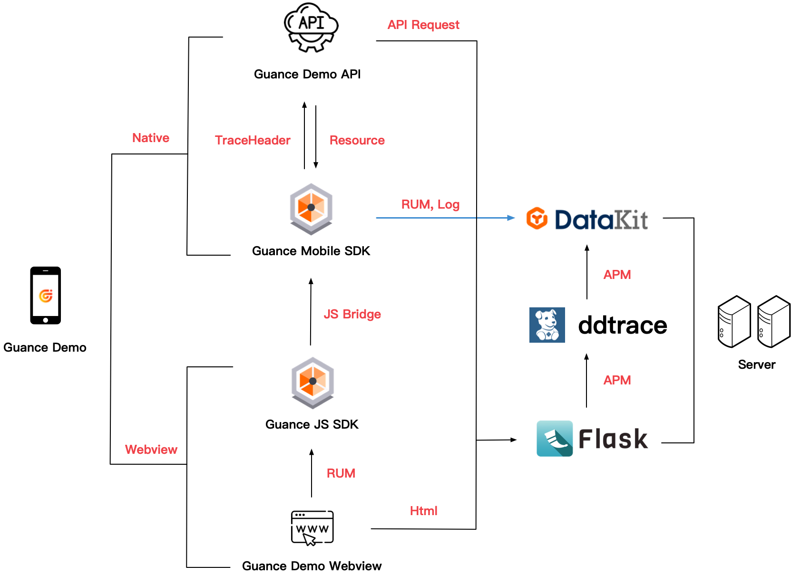
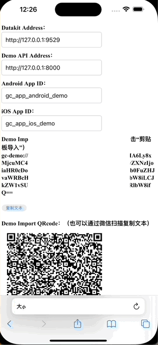

# guance-app-demo 
* [Server](./src/server)
* [Android](./src/android/demo)
* [iOS](./src/ios/demo)

# 
# 观测云 Demo 使用及部署说明
## 功能说明
* 输出「用户访问监测」数据，覆盖 Session View，Action，LongTask，Error，同时提供 Native View 原生页面和 Webview 的数据
* 输出「日志」数据
* 输出 「应用性能监测」数据
* 提供 SourceMap 崩溃日志符号还原

## 结构功能示意图


| **名词** | **含义**  |
| --- | --- |
|  Native |  这里指 Guance Demo 原生界面对应的数据处理|
|  Webview | 应用加载 html 使用的组件 |
|  Guance Demo Webview | 应用加载 html 使用的组件 |
|  Guance Demo API |  Demo API http 请求 |
|  Guance Mobile SDK | 观测云 Android iOS 移动端 SDK |
|  Guance JS SDK | 观测云 Web 监测 SDK |
|  JS Bridge | 指原生应用与 Webview 进行通信通道，观测云移动端 SDK 在 App 中 Webview 数据追踪通过 `Guance JS SDK` `JSBridge` 发送给 `Guance Mobile SDK` |
| RUM | [用户访问监测数据](https://docs.guance.com/real-user-monitoring/) |
| Resource | RUM 中网络请求数据 |
| TraceHeader | 指 APM 在 Http 请求中 Http Header 数据标记，上面会携带有 `TraceId`，`SpanId` 等数据 |

## 环境部署
* [Datakit 安装](https://docs.guance.com/datakit/datakit-install/) 
* 配置 [Datakit/ddtrace](https://docs.guance.com/integrations/ddtrace-python/)
* 准备 Demo 访问文件

	```	
	|-- app.py 						//配置 Demo App 所需 http 访问地址
	|-- static						//静态文件：js 及 图片文件
		|-- dataflux-rum.js			//观测云 Web js SDK 
		|-- images
			|-- logo.png			//Webview 显示图标
			|-- demo-logo.png		//移动端“我的”页面头像显示
		|-- jquery.mini.js			// jquery js
		|-- qrcode.mini.js			// 二维码处理
	|-- templates					
		|--index.html				//Demo App 访问的 Webview html
		|--import_helper.html		//GuanceDemo 快捷导入配置使用
	|-- update_input_value.py		//更新 import_helper.html 显示 datakit 和 Demo API 地址使用
	
	```		
* 替换 import_helper.html 显示地址
	* 脚本替换 (需要 `python3 `安装 `beautifulsoup4`)

	```bash
	python3 update_input_value.py demo-api-address-input $DEMO_API_ADDRESS templates/import_helper.html
	python3 update_input_value.py datakit-address-input $DATAKIT_ADDRESS templates/import_helper.html
	python3 update_input_value.py dataway-address-input $DATAWAY_ADDRESS templates/import_helper.html
	python3 update_input_value.py dataway-client-token-input $DATAWAY_CLIENT_TOKEN templates/import_helper.html
	```
	
	* 手动替换 `import_helper.html` 对应 `datakit-address-input ` ,`demo-api-address-input`
	
	| **变量** | **含义**  |
	| --- | --- |
	| datakit-address-input |  `import_helper.html` 中 Datakit Address 输入框 id |
	| dataway-address-input |  `import_helper.html` 中公网 Dataway 地址 |
	| dataway-client-token-input |  `import_helper.html` 中公网 Dataway 使用 `clientToken` 输入框 id |
	| demo-api-address-input |  `import_helper.html` 中 Demo API Address 输入框 id |
	| DATAKIT_ADDRESS | 本地部署 datakit 数据接入地址，例子：http://10.0.0.1:9529  |
	| DATAWAY_ADDRESS | 公网 dataway 数据接入地址，例子：http://10.0.0.1:9528  |
	| DATAWAY_CLIENT_TOKEN |  公网 dataway 认证使用 token |
	| DEMO_API_ADDRESS |  demo api 请求地址, 例子：http://10.0.0.1:8000  |


* 启动 Demo 访问后端服务

	```python
	DD_SERVICE=GC_SERVICE_SDK_DEMO \                   
	DD_SERVICE_MAPPING=postgres:postgresql,defaultdb:postgresql \
	DD_TAGS=project:sdk_demo,env:test,version:1.0 \
	DD_AGENT_HOST=localhost \
	DD_AGENT_PORT=9529 \
	ddtrace-run python3 app.py &> demo.log &
	```
>变量含义请查询  [Datakit ddtrace Python 部署环境变量](https://docs.guance.com/integrations/ddtrace-python/#envs)

## Sourcemap 功能
sourcemap 是用于 app 崩溃数据符号还原使用。
### 安装
* [Datakit 安装 sourcemap 工具 ](https://docs.guance.com/integrations/rum/#sourcemap)
* 下载最新 [sourcemap](https://static.guance.com/ft-mobile-demo/demo_source_map.zip) 

```
|-- demo_source_map.zip
	|-- gc_app_android_demo-prod-1.0.0.zip       //Android sourceMap
	|-- gc_app_ios-demo-prod-1.0.0.zip			    //iOS sourceMap
```
### Soucemap 上传
sourcemap 上传有两种方式， curl 或者手动放置，手动放置需要 datakit 部署机器的访问权限
#### CURL 上传

CURL 命令上传需要替换一下 `<dca_address>` 地址 ，这里是[官方文档](https://docs.guance.com/integrations/rum/#upload-delete)

```
#  demo_source_map 文件夹下执行

# Android 
curl -X POST '<dca_address>/v1/rum/sourcemap?app_id=gc_app_android_demo&env=prod&version=1.0.0&platform=android' -F "file=@gc_app_android_demo-prod-1.0.0.zip" -H "Content-Type: multipart/form-data"

# iOS
curl -X POST '<dca_address>/v1/rum/sourcemap?app_id=gc_app_ios-demo&env=prod&version=1.0.0&platform=ios' -F "file=@gc_app_ios-demo-prod-1.0.0.zip" -H "Content-Type: multipart/form-data"

```

#### 手动放置

```
//Android SourceMap 路径
/usr/local/datakit/data/rum/android

//iOS SourceMap 路径
/usr/local/datakit/data/rum/ios

```

#### 从观测云 Studio Web 上传
支持直接从 Studio 应用上[直接上传 source map](https://docs.guance.com/real-user-monitoring/sourcemap/set-sourcemap/#upload)

## App 安装
* Android: Demo [下载地址](https://static.guance.com/ft-mobile-demo/guance_sdk_demo.apk)
* iOS: 
	* 内部人员需提交[内测申请](https://confluence.jiagouyun.com/pages/viewpage.action?pageId=68715410)
	* 外部人员需自行源码打包安装


## GuanceDemo App 使用说明
GuanceDemo Datakit 地址和 Demo  api 地址可以随意变更，第一次使用必须要先进行
「编辑 Demo 配置」
### 登录
密码默认自动填充，用户名 `guance` 密码 `admin`

### 编辑 Demo 配置
「登录页面」 > 「编辑 Demo 配置」。 上报地址设置完毕后并保存配置，配置保存成功需要重启，iOS 需要自行后台杀进程。
##### 本地部署（Datakit）
输入对应 `RUM App Id` 、`Datakit Address` 地址和 `Demo API Address` 地址
##### 使用公网 DataWay
输入对应 `RUM App Id` 、`Dataway Address` 地址和 `Demo API Address` 地址


#### 剪切板导入
服务端部署完毕后，可以通过访问 `http://{demo_api_url}/improt_helper` 页面，进行快速配置导入。配置可以通过桌面端访问 improt_helper 页，然后用手机扫码获取，又或者从手机上访问 improt_helper 页，点击“复制文本”获取配置。

  

### 故障排查
在「编辑 Demo 」配置页面，你可以对 App 访问进行“地址检测”，你可以在「登录页面」和主界面的「我的」页面找到「编辑 Demo 配置」的入口。
 


