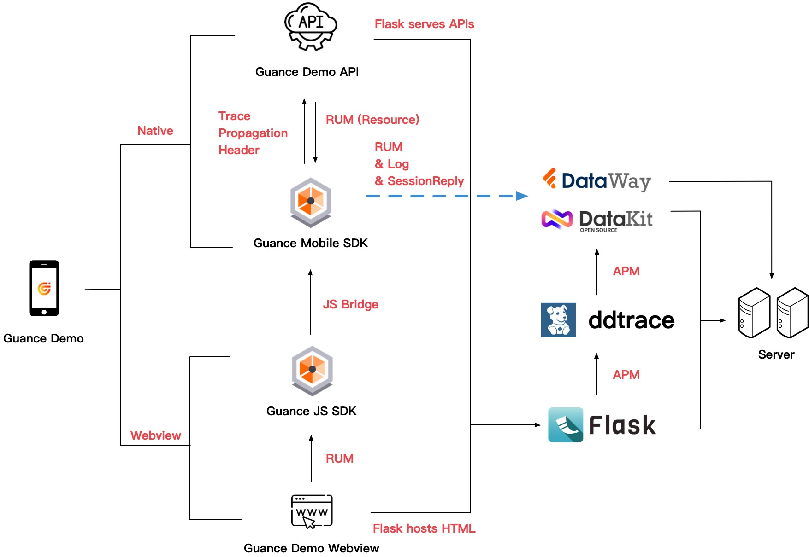
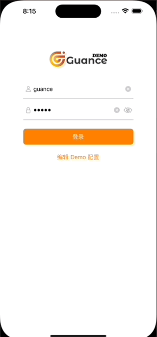
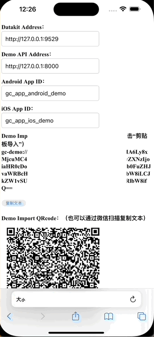

# guance-app-demo 
* [Server](./src/server)
* [Android](./src/android/demo)
* [iOS](./src/ios/demo)

# 
# Guance Cloud Demo Usage and Deployment Instructions
## Function Description
* Outputs "RUM" data, covering Session View, Action, LongTask, Error, and provides data for both Native View and Webview pages
* Outputs "Log" data
* Outputs "Application Performance Monitoring" data
* Provides SourceMap crash log symbolication

## Structure Function Diagram


| **Term** | **Meaning**  |
| --- | --- |
|  Native |  Refers to the data processing corresponding to the Guance Demo native interface |
|  Webview | The component used by the app to load HTML |
|  Guance Demo Webview | The component used by the app to load HTML |
|  Guance Demo API |  Demo API HTTP requests |
|  Guance Mobile SDK | Guance Cloud Android/iOS mobile SDK |
|  Guance JS SDK | Guance Cloud Web monitoring SDK |
|  JS Bridge | Refers to the communication channel between the native app and Webview. Guance Cloud mobile SDK tracks Webview data in the app by sending it to the Guance Mobile SDK via `Guance JS SDK` and `JSBridge` |
| RUM | [RUM Data](https://docs.guance.com/real-user-monitoring/) |
| Resource | Network request data in RUM |
| TraceHeader | Refers to the APM Http Header data marker in Http requests, which carries data such as `TraceId`, `SpanId`, etc. |

## Environment Deployment
* [Datakit Installation](https://docs.guance.com/datakit/datakit-install/) 
* Configure [Datakit/ddtrace](https://docs.guance.com/integrations/ddtrace-python/)
* Prepare Demo access files

	```	
	|-- app.py // HTTP access addresses required for Demo App configuration
	|-- static // Static files: js and image files
		|-- dataflux-rum.js // Guance Cloud Web js SDK 
		|-- images
			|-- logo.png // Webview display icon
			|-- demo-logo.png // Avatar display on the mobile "Mine" page
		|-- jquery.mini.js // jquery js
		|-- qrcode.mini.js // QR code processing
	|-- templates					
		|--index.html // Webview html accessed by Demo App
		|--import_helper.html // GuanceDemo quick import configuration usage
	|-- update_input_value.py // Used to update datakit and Demo API addresses displayed in import_helper.html
	
	```		
* Replace the address displayed in import_helper.html
	* Script replacement (requires `python3` and `beautifulsoup4` installed)

	```bash
	python3 update_input_value.py demo-api-address-input $DEMO_API_ADDRESS templates/import_helper.html
	python3 update_input_value.py datakit-address-input $DATAKIT_ADDRESS templates/import_helper.html
	python3 update_input_value.py dataway-address-input $DATAWAY_ADDRESS templates/import_helper.html
	python3 update_input_value.py dataway-client-token-input $DATAWAY_CLIENT_TOKEN templates/import_helper.html
	```
	
	* Manually replace the corresponding `datakit-address-input`, `demo-api-address-input` in `import_helper.html`
	
	| **Variable** | **Meaning**  |
	| --- | --- |
	| datakit-address-input |  The Datakit Address input box id in `import_helper.html` |
	| dataway-address-input |  The public Dataway address in `import_helper.html` |
	| dataway-client-token-input |  The input box id for public Dataway `clientToken` in `import_helper.html` |
	| demo-api-address-input |  The Demo API Address input box id in `import_helper.html` |
	| DATAKIT_ADDRESS | Local deployment datakit data access address, e.g.: http://10.0.0.1:9529  |
	| DATAWAY_ADDRESS | Public dataway data access address, e.g.: http://10.0.0.1:9528  |
	| DATAWAY_CLIENT_TOKEN |  Token for public dataway authentication |
	| DEMO_API_ADDRESS |  Demo api request address, e.g.: http://10.0.0.1:8000  |


* Start the Demo backend service

	```python
	DD_SERVICE=GC_SERVICE_SDK_DEMO \                   
	DD_SERVICE_MAPPING=postgres:postgresql,defaultdb:postgresql \
	DD_TAGS=project:sdk_demo,env:test,version:1.0 \
	DD_AGENT_HOST=localhost \
	DD_AGENT_PORT=9529 \
	ddtrace-run python3 app.py &> demo.log &
	```
>For variable meanings, please refer to [Datakit ddtrace Python deployment environment variables](https://docs.guance.com/integrations/ddtrace-python/#envs)

## Sourcemap Function
Sourcemap is used for app crash data symbolication.
### Installation
* [Datakit install sourcemap tool ](https://docs.guance.com/integrations/rum/#sourcemap)
* Download the latest sourcemap
	* [Android](https://static.guance.com/ft-mobile-demo/android_source_map.zip) 
	* [iOS](https://static.guance.com/ft-mobile-demo/ios_source_map.zip) 

### Sourcemap Upload
#### Upload from Guance Cloud Studio Web
Supports uploading source map via the Studio app [upload source map](https://docs.guance.com/real-user-monitoring/sourcemap/set-sourcemap/#upload)

## App Installation
* Android: Demo [Download Link](https://static.guance.com/ft-mobile-demo/guance_sdk_demo.apk)
* iOS: 
	* External users need to build and install from source code



## GuanceDemo App Usage Instructions
GuanceDemo Datakit address and Demo api address can be changed at will. The first use must first
"Edit Demo Configuration"
### Login
The password is automatically filled in by default. Username `guance` Password `admin`

### Edit Demo Configuration
"Login page" > "Edit Demo Configuration". After setting and saving the reporting address, you need to restart after the configuration is saved. For iOS, you need to manually kill the process in the background.
##### Local Deployment (Datakit)
Enter the corresponding `RUM App Id`, `Datakit Address`, and `Demo API Address`
##### Use Public DataWay
Enter the corresponding `RUM App Id`, `Dataway Address`, and `Demo API Address`


#### Import from Clipboard
After the server is deployed, you can quickly import the configuration by visiting `http://{demo_api_url}/improt_helper` page. The configuration can be accessed on the desktop by visiting the improt_helper page and scanning the QR code with your phone, or by visiting the improt_helper page on your phone and clicking "Copy Text" to get the configuration.

  

### Troubleshooting
On the "Edit Demo" configuration page, you can perform "Address Check" for App access. You can find the entrance to "Edit Demo Configuration" on the "Login page" and the "Mine" page of the main interface.
 


